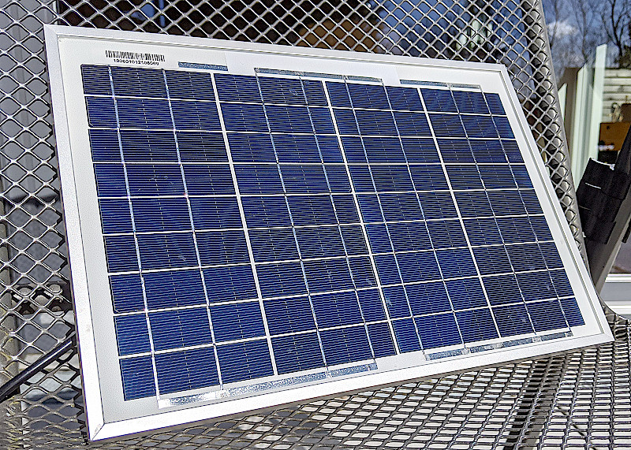
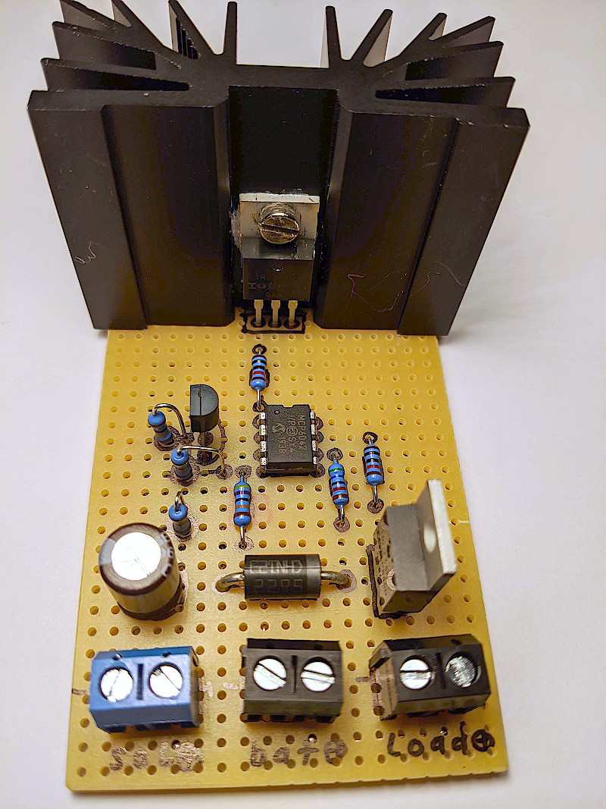
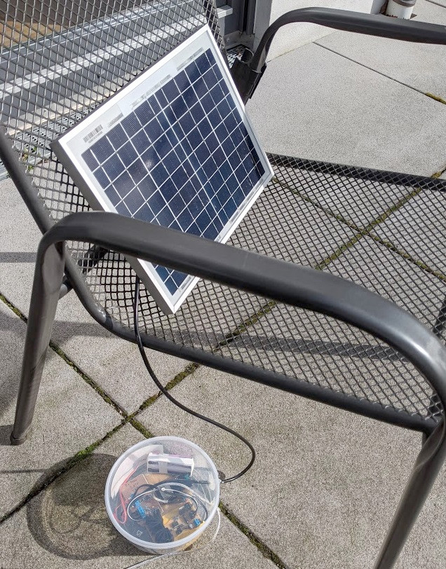
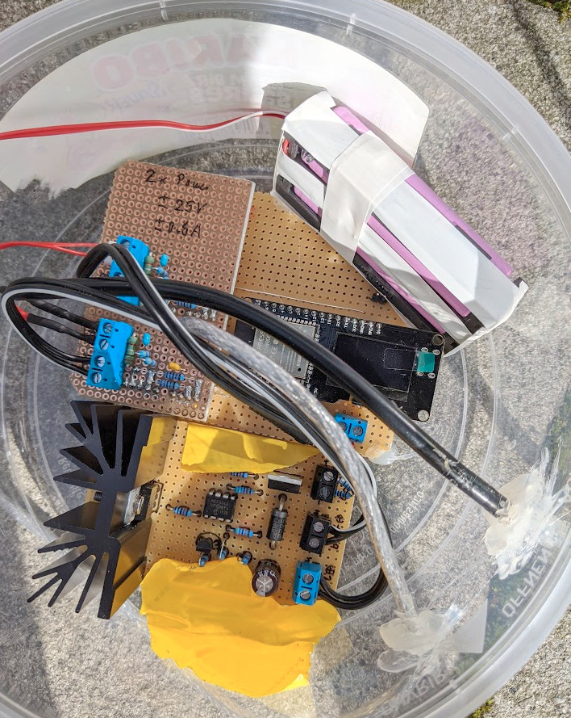
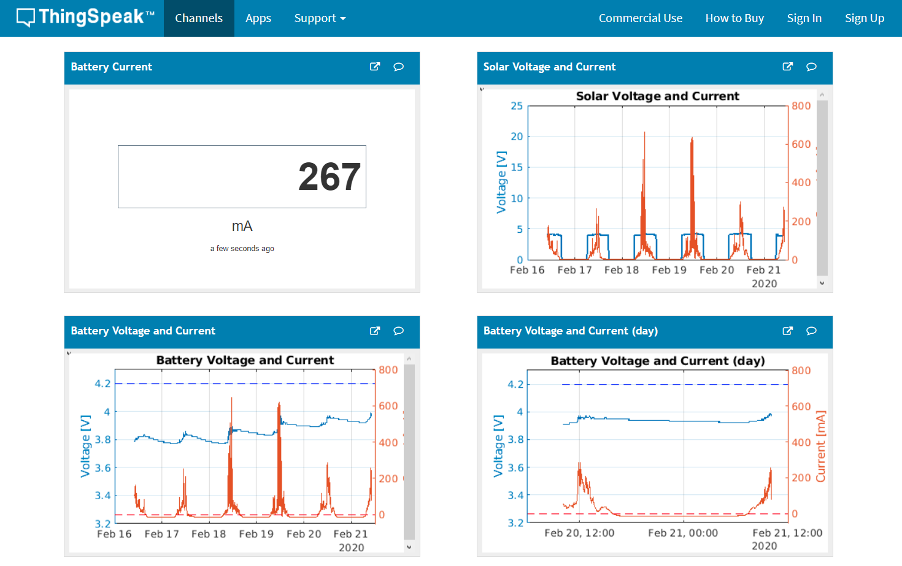
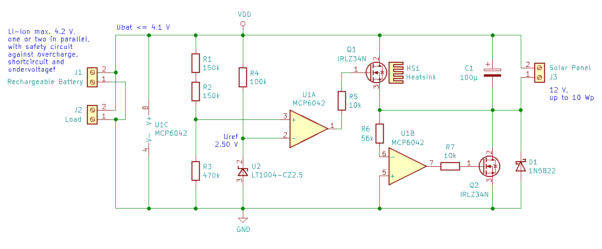
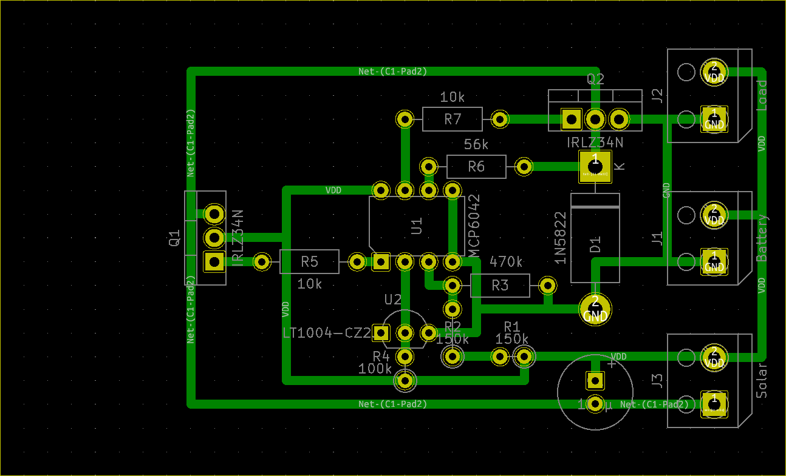
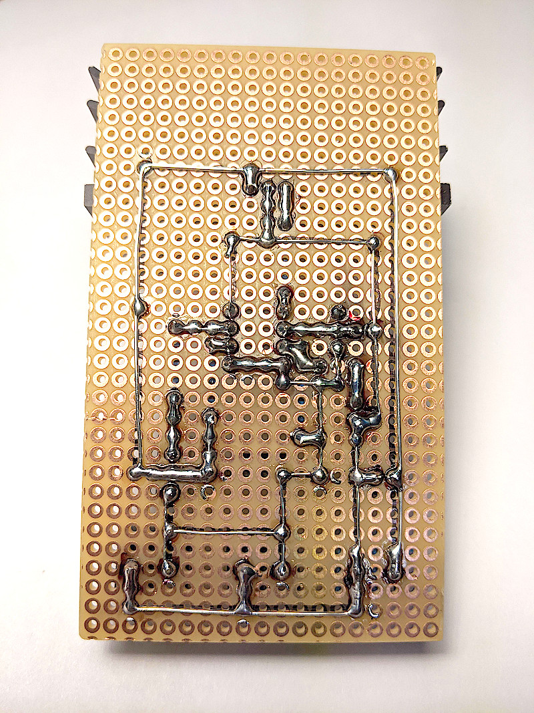

# Solar Power Supply - Energy Harvesting

 

This is a stand-alone solar power supply for operation of micro controller projects with li-ion rechargeable batteries and a highly efficient charge controller. It's optimized to harvest the maximum energy from small solar panels in dull winter weeks, when many MPPT (maximum power point tracking) controllers harvest no energy at all. It's not meant to get the most power out of the panel in bright summer sun. That's where MPPT controllers have their place. For powering a stand-alone application, the supply must work for the worst case.

Charging and power supply of the application work in parallel. When there is more current from the solar panel than needed by the application load, the battery will charge up. When there is less, the battery delivers the missing current.

Be aware that small solar panels only produce a small amount of energy in winter and on dull days. This may be only around a percent of the panel's rated peak performance. So, it's absolutely important to bring down the power consumption of your application to a few milli-amperes. Otherwise it will inevitabely run out of battery after some winter weeks.

You may have a look into my comparison of some ESP32 dev boards and their power consumptions in different sleep modes: https://github.com/grillbaer/esp32-power-consumption-test

IMPORTANT:
* Feel free to use this as a base for own projects. But be aware that you do this at YOUR OWN RISK. I take no responsibility for any caused damages or for the correctness of the information given here!
* Lithium-ion batteries are potentially dangerous. They can cause fire or even explode when treated wrongly! Use only batteries with safety protection circuits! Do not expose them to heat, think about the summer sun! Have a look into the data-sheet for proper handling!

# ThingSpeak Performance Logging

To test and enhance the circuit, I've got an experimental set-up with a 10 Wp 12 V solar panel, two in-parallel Samsung INR18650-35E 3500mAh cells and a ~50 mW load resistor. An ESP32 and two ADS1115 ADCs perform on-going measurement and data transmission to ThingsPeak, see project https://github.com/grillbaer/esp32-iot-logger.

 

Note that there were several changes in the circuit and set-up over time which influence the results:

https://thingspeak.com/channels/964991

# Shunt Charge Controller V3.3

This charge controller tries to reduce all power losses to the absolute minimum. Almost 100 % of the solar energy goes directly into battery charging and/or the attached load until the battery is fully charged. To prevent over-charging, the N-MOSFET Q1 with a heat sink acts as a shunt that converts excess power into heat when a battery voltage of 4.1 V is reached. The 4.1 V is below the typical maximum allowed battery voltage of 4.20 V to account for component tolerances, battery environment temperature and for the fact that the float charge will not be cut off by this circuit.

The second N-MOSFET Q2 prevents flowback from the battery into the solar panel at night. This could be done by the Schottky diode alone, but the N-MOSFET has only some milli-volts drop during charging whereas the diode would have about 0.3 V.

The controller does not perform any max power-point tracking (MPPT) to get into the peak power production region of the solar panel. The solar panel will work close to the battery voltage. This is not ideal for harvesting the maximum power in the summer, but it is quite well optimized for the low solar irradiance in the middle of winter, where most MPPT trackers do not work at all. This is the goal of the whole project: It does not matter whether we loose some power in the summer, we need to get every milli-watt in the dull winter months!

Notes:
* Hand-select N-MOSFETs with a very low threshold voltage VGS(th) of below 2.5 V! Many IRLZ34N have VGS(th) up to 4 V which will not work here. Alternatively, select another MOSFET type with guaranteed lower threshold voltage.
* You can leave out R6, R7 and Q2 in the bottom right corner of the schematic and rely on the Schottky diode D1 to prevent flowback from battery. Then, also the op-amp could be a simpler model, since real rail-to-rail for input and output would not be needed. However, the efficiency will drop to about 90 % while charging due to the higher voltage drop of the diode. The other way around, you can leave out the Schottky diode if Q2 is used. This saves about 100 µA leakage current of the diode at night.
* This op-amp type has been chosen because it is a real rail-to-rail type for input and output, works down to below 3 V supply and is really a micro-power one. This is very important, since it always draws its supply current from the battery and it makes a huge difference here whether it needs only 2 µA or 2 mA.
* Also hand-select R1+R2 and R3 to have quite exact values. Otherwise, the upper charging limit voltage may be higher. Lithium-ion batteries must absolutely not be charged with too high voltages, usually not over 4.20 V. Look into the data-sheet of your battery!
* The charging current is not limited by this circuit. Think about the maximum current your solar panel could deliver and use matching batteries. Example: a 10 Wp panel at 3 V has 3.3 A maximum current. So choose (a parallel pair of) batteries which are fine with 3.3 A charging current. In reality, the worst case maximum current of the panel will likely be smaller due to local irradiance, panel temperature and the non-optimum voltage for maximum power. However, keep it on the safe side! Only put identical cells with the same charging state in parallel to avoid high balancing currents!
* Do NOT use batteries in-series by adjusting the max charging voltage of this circuit to 8.2 V. This op-amp is rated for an absolute maximum of 7 V. Also, in-series batteries require load balancing to permanently keep both cells within their safe limits.
* ONLY use lithium-ion batteries with 4.20 V with safety circuit to prevent deep discharge, over-current or short-circuit and also as a second safety against over-charging if this controller gets damaged. Batteries can explode or catch fire!
* The heat sink must be able to lead away the whole maximum power from the solar panel in the warmest expected environment without exceeding the maximum allowed temperature of the FET. This is the drawback of the simple shunt circuit. Do not place the heat-sink in direct sun!

# Circuit Board

The KiCAD files in this project contain a one-sided PCB layout that can be built-up on a 2.54 mm raster breadboard as prototype:

# Prototype

 
